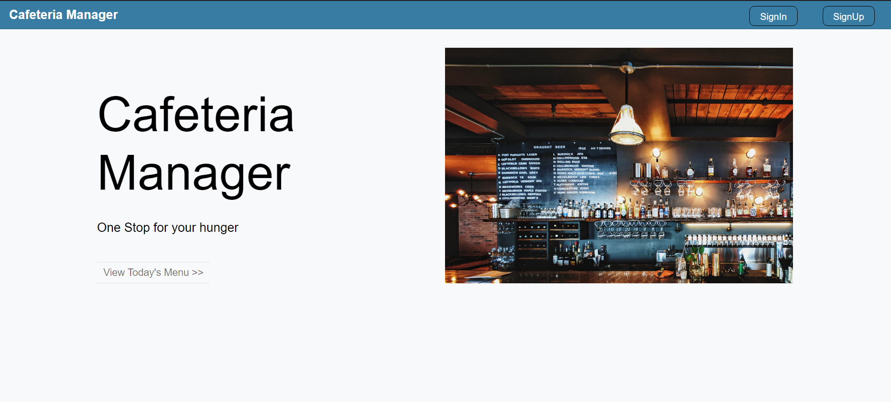

# CAFETERIA-MANAGER-SAAS-SOFTWARE

The Cafeteria Manager  is  a fully functioning SaaS software that can be used by any number of users on the web.

[HEROKU LINK](https://cafeteria-manager-saas.herokuapp.com)

##### admin email : cafeteriamanager2021@gmail.com
##### admin password: saasproject2021

##### clerk email : clerk@gmail.com
##### clerk password: clerk

## The features present in the application are:

### Online Customer persona

* Customer should be able to Sign-up

* Customer can see the menu and add items to cart

* Customer should see the cart while ordering

* Customer can finalize the order with a “checkout” button

* Customer can see the status of orders

* The shopping cart should be durable and available across sessions

### Cafeteria Billing Clerk

* Clerk can mark orders as delivered.

* Clerk can create orders for offline customers.

### Cafeteria Owner

* Owner can manage the menu.

* Owner can see reports.

* Owner can manage users.

